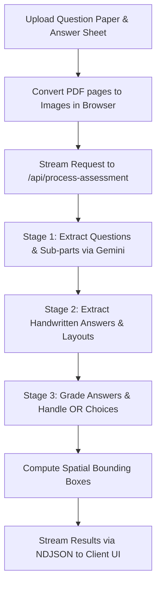

# 📚 VedaAI — AI Assessment Extraction & Answer Mapping Platform

[](https://nextjs.org/)
[](https://tailwindcss.com/)
[](https://ai.google.dev/)
[](https://supabase.com/)

**VedaAI** is a web application designed for educators to automate the extraction, mapping, visual highlighting, and grading of student handwritten answer sheets against question papers.

---

## 🌟 Key Features

- **⚡ 3-Stage AI Processing Pipeline:**
  - **Stage 1 (Question Extraction):** Parses printed question papers (PDF/Images) into structured questions, sub-parts (`18(a)(i)`, `18(a)(ii)`), printed labels, mark allocations, and alternative/OR choice pairs.
  - **Stage 2 (Answer & Layout Extraction):** Extracts handwritten text, start/end line anchors, page indexes, and text layouts from student answer sheets.
  - **Stage 3 (AI Grading & Feedback):** Evaluates answers against questions, computes scores per question, flags un-attempted alternatives, and generates detailed strengths, weak areas, and teacher feedback notes.

- **🔍 Interactive Bounding Box Highlighting:**
  - Synchronized view between extracted questions and student answer sheets.
  - Clicking any question auto-scrolls the viewer and renders an exact visual highlight over the handwritten answer on the sheet.

- **🔀 Alternative / OR Choice Intelligence:**
  - Automatically identifies "OR" question pairs (e.g. Q18 Option A vs Option B).
  - Grades only the option attempted by the student and cleanly excludes un-attempted options without penalizing total scores.

- **🔑 Dual-Key API Failover Strategy:**
  - Features a multi-key fallback (`GEMINI_API_KEY_1` ➔ `GEMINI_API_KEY_2`).
  - If Key 1 hits a rate limit (`429`), the pipeline switches immediately to Key 2 without backoff delay or token loss.

- **📊 Comprehensive Results & Export:**
  - Teacher dashboard with score breakdown, question-by-question feedback, and manual re-mapping overrides.
  - Export options for evaluation reports.

---

## 🛠️ Tech Stack

- **Framework:** [Next.js 15](https://nextjs.org/) (App Router, Server-Sent NDJSON Streams)
- **AI Vision Engine:** `@google/genai` (Gemini 3.5 Flash)
- **Styling:** Tailwind CSS, Framer Motion, Lucide Icons
- **Document Processing:** `pdfjs-dist` (In-browser PDF-to-Image rendering), `jspdf`, `html2canvas`
- **Database:** Supabase (`@supabase/supabase-js`)

---

## 📁 Repository Structure

```text
VedaAI/
├── src/
│   ├── app/
│   │   ├── api/
│   │   │   └── process-assessment/  # Multi-stage Gemini AI streaming endpoint
│   │   ├── assignments/             # Assignments list view
│   │   ├── classroom/               # Classroom management view
│   │   ├── exams/                   # Core assessment processor & results viewer
│   │   ├── library/                 # Saved papers & resources
│   │   ├── globals.css              # Global design system & theme tokens
│   │   ├── layout.jsx               # Root layout & sidebar navigation
│   │   └── page.jsx                 # Landing page
│   ├── components/
│   │   ├── layout/                  # Sidebar & Header components
│   │   ├── processing/              # Processing progress modal & state
│   │   ├── results/                 # Question list, Answer viewer & Grading summary
│   │   └── upload/                  # File dropzone & paper configuration
│   └── lib/
│       ├── gemini.js                # Client-side streaming pipeline handler
│       ├── highlightUtils.js        # Bounding box & text anchor alignment algorithms
│       ├── pdfUtils.js              # Client PDF page extraction & image scaling
│       ├── studentUtils.js          # Student dataset & metadata utilities
│       └── supabase.js             # Supabase client setup
├── public/                          # Static assets
├── .env.local                       # Local environment variables
├── package.json
└── README.md
```

---

## 🚀 Getting Started

### Prerequisites

- **Node.js**: `v18.x` or higher
- **npm**: `v9.x` or higher
- **Google Gemini API Key(s)**: Obtain from [Google AI Studio](https://aistudio.google.com/)

### 1. Installation

Clone the repository and install dependencies:

```bash
git clone https://github.com/harshitmathur456/Veda-AI.git
cd Veda-AI
npm install
```

### 2. Environment Configuration

Create a `.env.local` file in the root directory:

```env
# Gemini API Keys (Sequential fallback on 429 rate limit)
GEMINI_API_KEY_1=your_gemini_api_key_1
GEMINI_API_KEY_2=your_gemini_api_key_2

# Supabase Credentials
NEXT_PUBLIC_SUPABASE_URL=your_supabase_project_url
NEXT_PUBLIC_SUPABASE_ANON_KEY=your_supabase_anon_key
SUPABASE_PROJECT_ID=your_supabase_project_id
```

### 3. Run Development Server

Start the local Next.js development server:

```bash
npm run dev
```

Open [http://localhost:3000](http://localhost:3000) in your browser to view the application.

### 4. Build for Production

To create an optimized production build:

```bash
npm run build
npm run start
```

---

## ⚡ How It Works (Pipeline Overview)



1. **Client-side PDF Pre-processing:** Uploaded PDFs are converted to high-resolution page canvas images in the browser before sending to the backend.
2. **Server-Side Streaming (`/api/process-assessment`):** The Next.js API route streams real-time NDJSON progress updates (`Stage 1` ➔ `Stage 2` ➔ `Stage 3` ➔ `Result`).
3. **Sequential Failover:** API requests use `GEMINI_API_KEY_1` first. If Google API returns a `429` rate limit error, it instantly retries using `GEMINI_API_KEY_2`.

---

## 📄 License

This project was created for the VedaAI Assignment. All rights reserved.
